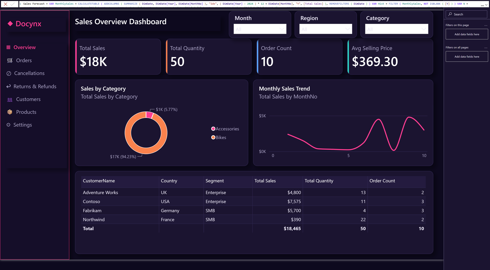
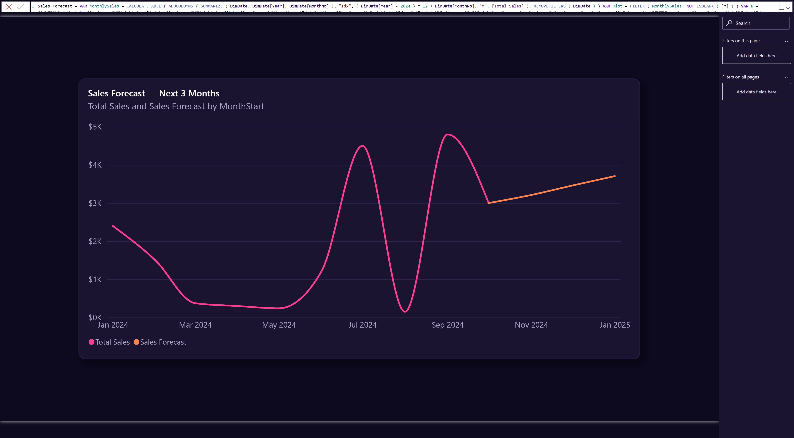

A few years ago, AI in Power BI could only help you "answer questions." Now it can help you build a report from scratch — together with the data model behind it.

I recently connected Microsoft's **Power BI Agentic** stack — the **Power BI Modeling MCP server** plus the report-authoring skills (Skills for Fabric) — to an AI coding assistant, and ran a full "design BI in natural language" loop end to end. Here's the framework — no code, just how it works and why it's worth watching.

## Two layers AI now works on

**📊 The semantic model layer — the "brain" of the data**
Measures, calculation logic, fields, relationships. You say *"I want a sales forecast,"* and the AI builds that logic into the model.

**🎨 The report layer — the "face" of the data**
Pages, visuals, layout, color; generate the report files; reload and screenshot in Power BI Desktop.

## How it actually works

Both layers run on the same mechanism:

- **🧠 Skills** tell the AI *how* to do it — modeling and design best practices.
- **🛠️ Tools** let the AI *actually do it* — the **Power BI Modeling MCP server** connects the agent to your live model (read the schema, create and edit measures, run DAX), while a report-authoring toolkit writes the report files and drives Power BI Desktop.

*(MCP — the Model Context Protocol — is the open standard that lets AI agents safely talk to tools like Power BI. Think of it as the "USB-C port" between AI and enterprise software.)*

Together they form a loop:

**Understand the model → design → generate (model + report) → validate → reload & screenshot → review and refine**

## One intent, two layers

Take this prompt: *"Add a page with a line chart showing the next three months of sales forecast, styled like the first page."*

It spans both layers — through the **MCP server** the AI builds the forecast logic in the model, then through the report skill it renders a themed chart in the report.

Here is what it produced, on top of the dashboard above:

The pink line is actual sales; the orange line is the forecast for the next three months — built into the model and rendered to match the first page's theme. **I made this by describing what I wanted, in about 10 minutes.**

## What this means

Modeling and report-building used to be two separate crafts, done by hand. Now technical execution is being compressed — and human value moves up, to *understanding the business problem* and *judging whether the result is right*. That is the consultant's moat in the AI era.

One thing worth stressing: this was not the polished flow from a demo video. I ran the full loop on a real model — including the errors and fixes along the way. AI helps surface problems and outline the challenge, but solving them and owning the judgment still rests with you.

If you work in enterprise BI, this "AI delivers, human judges" collaboration — from data logic to visualization — is worth trying now.
