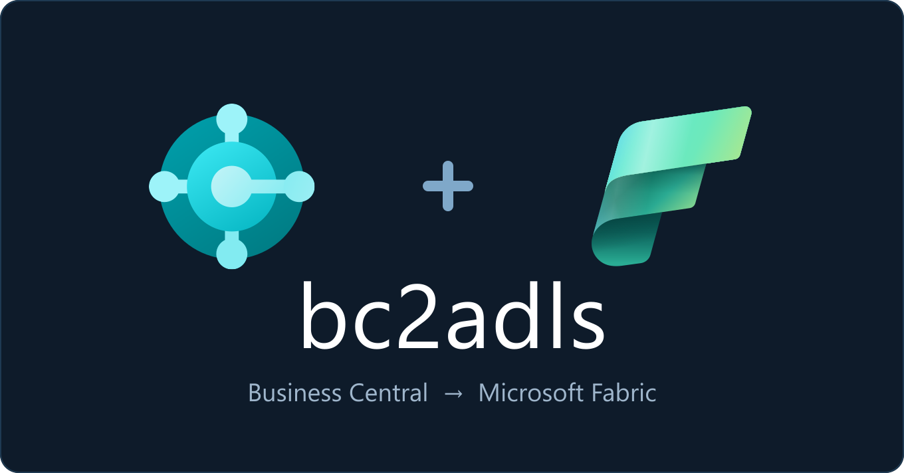
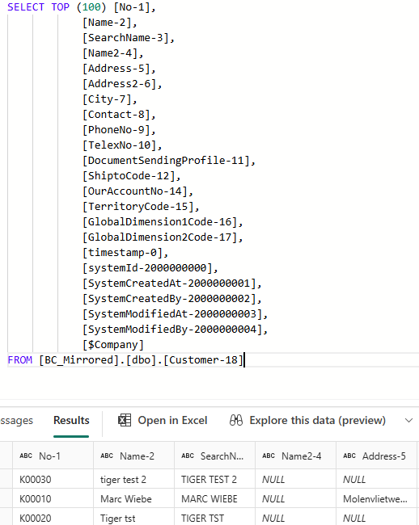

Most BC consultants I talk to don't know this tool exists.

If you run Dynamics 365 Business Central and want your data in Microsoft Fabric — for reporting, analytics, or a proper lakehouse — the usual answer is "export to Excel" or "build a custom API."

There's a much better way: **bc2adls**.

I set it up end to end in my own environment last week. Here's what actually matters — including the one thing that tripped me up.

## What it does

bc2adls is an open-source BC extension that exports your data **incrementally** to Azure Data Lake or Microsoft Fabric — automatically, on a schedule.

Not a full dump every time. Only the rows that changed since the last run. You configure it once, and BC's Job Queue runs it in the background.

## How it works

- A change happens in BC
- Job Queue fires on schedule
- A delta file lands in your Fabric landing zone
- Fabric's Open Mirroring picks it up via native CDC
- Your Lakehouse table updates
- Power BI sees fresh data

No custom pipelines. No notebooks. No manual triggers.

## The one thing that confused me

After my first sync, I opened the tables in Fabric and every table and field had a number stuck on the end: `Customer-18`, `No-1`, `Name-2`, even system fields like `SystemModifiedAt-2000000003`.

Those numbers aren't random — they're the **Business Central object IDs**. Tables come out as `{TableName}-{TableID}` (Customer is table 18), and fields carry their AL field number. bc2adls adds them so tables with the same caption never collide in the lake.

Functional, but ugly — and it makes life harder for whoever builds the Power BI model on top.

The fix is hidden: on the Setup page, under **Data Format**, click **"Show more"** — the toggle (`IDs for Duplicates Only`) is collapsed by default. Turn it on and IDs only appear when there's a real name clash. Everything else becomes clean: `Customer`, `No`, `Name`.

Two things I learned the hard way:

1. It doesn't rename retroactively — you have to **re-export the schema** for it to take effect.
2. If you've already built reports on `Customer-18`, switching to `Customer` creates a *new* table and **breaks every existing reference.** Set this before you build on top — not after.

## A few setup notes

**Scheduling** — Match the Job Queue interval to the data. Transactions (orders, invoices): hourly. Master data (customers, items): every 4–6 hours. Config data: daily. Don't run everything at the same frequency.

**On-premises only** — If your BC is on-prem, check one server setting first: `DisableWriteInsideTryFunctions`. It defaults to `True`, which blocks bc2adls from writing its token cache — you'll hit silent auth errors that are painful to debug. Set it to `False`. (BC SaaS doesn't have this problem.)

**It's batch, not real-time** — Total latency = Job Queue interval + a few minutes for Fabric. For most reporting, that's plenty. If you need sub-minute freshness, look at Microsoft's native BC Mirroring instead.

## The honest trade-offs

**What it does well**

- Incremental by design — only changed rows, no full dumps
- No custom code — Open Mirroring handles deltas automatically
- Per-table scheduling — high-frequency for transactions, daily for master data
- Multi-company support out of the box
- Free, open-source, actively maintained

**Where it has limits**

- Not real-time (batch only)
- On-prem adds configuration overhead
- You depend on a community fork (more on that below)
- Requires Azure App Registration setup

## A thank you to the maintainer

bc2adls was originally a Microsoft project. That repo is now archived and read-only — but the project lives on because **Bert Verbeek** ([@Bertverbeek4PS](https://github.com/Bertverbeek4PS)) picked it up and has maintained it ever since. It's on v28.57, with 40+ releases and growing adoption.

If you use it, go give the repo a star: [github.com/Bertverbeek4PS/bc2adls](https://github.com/Bertverbeek4PS/bc2adls)

---

BC holds your operational truth — sales, inventory, financials. Fabric is where modern analytics lives. bc2adls is the bridge most people don't know about, and it takes an afternoon to set up.

If you're building a data & AI practice on BC, this belongs in your toolkit.

*Have you used bc2adls on a client project? What was your setup like?*
