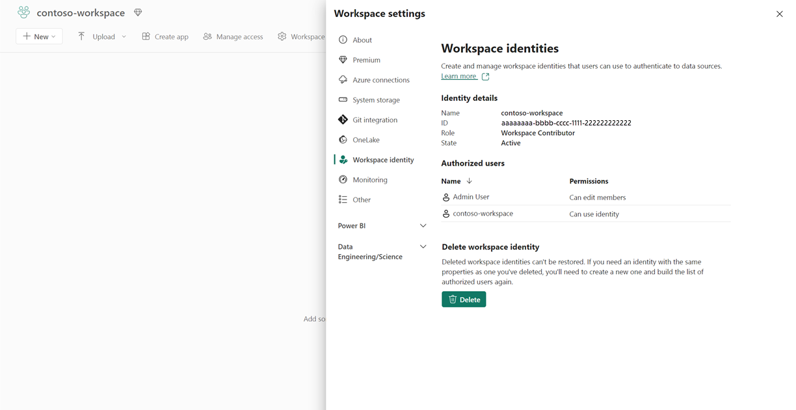
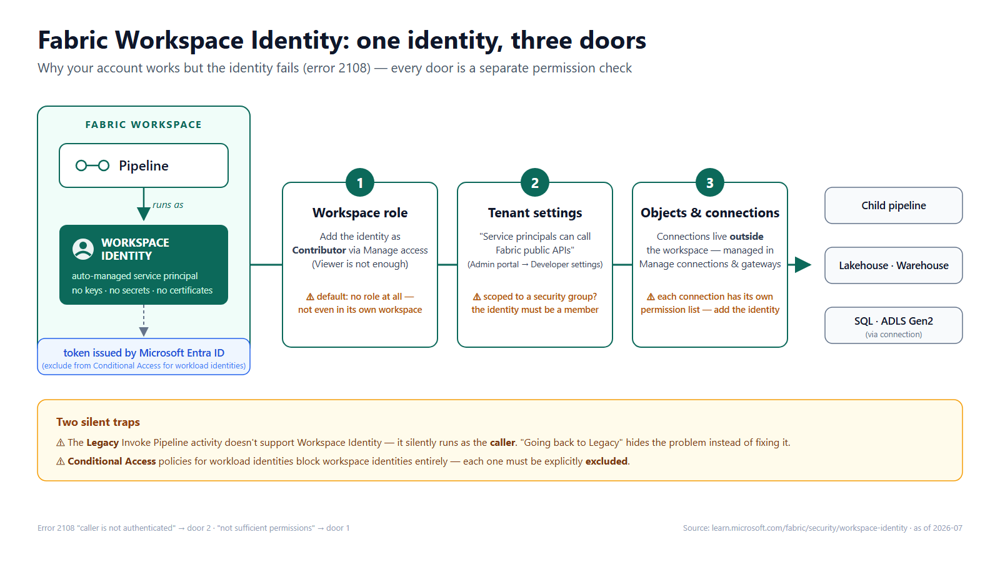

Last week, a Fabric pipeline stopped me cold with this error:

**"Unauthorized – The caller is not authenticated to access this resource"** (error code 2108)

The confusing part? The exact same pipeline ran perfectly under my own account. It only failed when the connection switched to **Workspace Identity**.

If you haven't met Workspace Identity yet, you probably will soon — so here's what I learned the hard way.

## What is a Workspace Identity?

It's an automatically managed service principal bound to a Fabric workspace (one per workspace, same name as the workspace). When you create one, Fabric creates a service principal and an app registration in Microsoft Entra ID and manages the credentials for you — no keys, no secrets, no certificates to rotate, nothing to leak. A workspace admin creates it in *Workspace settings → Workspace identity* (any workspace except My Workspace), and from then on pipelines, OneLake shortcuts, semantic models, and Dataflows Gen2 can authenticate as the workspace itself instead of as a person. (Generally available — as of 2026-07, [learn.microsoft.com](https://learn.microsoft.com/fabric/security/workspace-identity))

That's the right direction: workloads shouldn't run on someone's personal account that breaks when they leave or their password resets.

So why the error?

## The trap: "no credentials to manage" ≠ "no permissions to configure"

On paper, the official setup is three steps: create the identity → grant it permissions → select it as the authentication method in your connection. Simple. In practice, the failures hide in **three permission layers**, and most people (me included) only configure the first.

### Door 1: The workspace role

The docs say it plainly: *"By default, the workspace identity is not granted any workspace role."* Not even in its own workspace — being "in the same workspace" grants nothing. Add it as **Contributor** under *Manage access* (Viewer is not enough — I tested). The misleading part: your own account works because *you* have permissions. That proves nothing about the identity.

### Door 2: The tenant settings

The exact error wording matters more than you'd think:

- *"caller is **not authenticated**"* → check the tenant setting **"Service principals can call Fabric public APIs"** (Admin portal → Tenant settings → Developer settings).
- The biggest trap hides in its scope: if it's set to *"Specific security groups"*, your Workspace Identity must be a **member of that group**. The toggle showing "Enabled" is not enough.
- *"caller does **not have sufficient permissions**"* → that's door 1, the workspace role.

Two errors that look like twins, two completely different fixes.

### Door 3: Objects and connections

This is not door 1 again. The workspace role covers objects *inside* that workspace — but pipelines also touch things that live *outside* it: objects in **other workspaces**, and especially **data connections**. Connections don't belong to any workspace — they're managed centrally (*Manage connections and gateways*) and each one has its **own permission list, independent of workspace roles**. Classic trap: the connection works for you because *you created it* — the identity isn't on its user list at all. Add the identity under *Manage users* on each connection it needs.

## Two silent traps

- Only the **new** Invoke Pipeline activity supports Workspace Identity authentication. The Legacy version doesn't — it silently runs as the caller instead, which is why "going back to Legacy" seems to fix things while actually hiding the problem.
- If your organization has a **Conditional Access policy for workload identities**, each workspace identity must be **excluded** from it — otherwise they simply won't work. ([Official docs](https://learn.microsoft.com/fabric/security/workspace-identity-authenticate), as of 2026-07)

Here's the whole picture in one diagram:

## Takeaway

Keyless authentication is clearly where the platform is going. But when a service identity fails where your personal account succeeds, don't trust your own login as evidence — walk the three doors: workspace role → tenant settings (and their scope) → object access.

Have you run into 2108? I'd like to hear which door it was.
