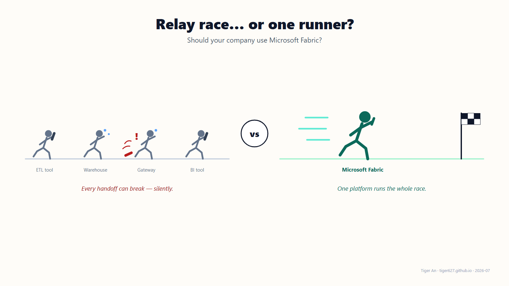
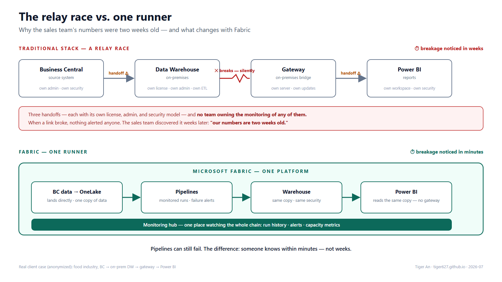
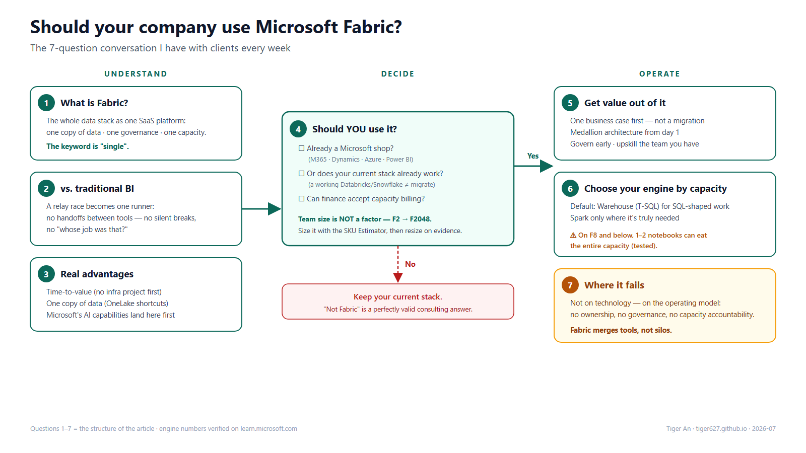

Most companies buy Microsoft Fabric. Few actually use it well.

As a data consultant, I keep having two versions of the same conversation. Before the contract: *"Should we move to Fabric at all?"* And after it: *"We have Fabric now… what exactly are we supposed to do with it?"* The answer to both is the same seven questions — walked in order: what Fabric is, whether **you** should use it, and if yes, how to run it well.

## 1. What is Fabric, actually?

One sentence: Microsoft's entire data stack — pipelines, lakehouse, warehouse, real-time analytics, data science, and Power BI — merged into a single SaaS platform, on a single copy of data (OneLake), under a single security and governance model, paid for with a single capacity.

The key word isn't any of the features. It's **"single."**

## 2. How is that different from a traditional BI platform?

A traditional stack is a **relay race**: an ETL tool hands off to a data warehouse, which hands off to a semantic layer, which hands off to a BI tool — each with its own license, its own admin, its own security model, and its own consultant. Every handoff is a place where data breaks, documentation dies, and projects stall.

Fabric is the same race run by **one runner**. Storage is shared by default (shortcuts instead of copies), security is defined once, and the person who builds the pipeline can be the person who builds the report — in the same browser tab.

A real example (anonymized): a food-industry client whose sales team kept finding that their numbers were **up to two weeks old**. The chain behind it: Business Central → an on-premises data warehouse → an on-premises gateway → Power BI. Three handoffs — and no team owning the monitoring of any of them. When a link broke, nothing alerted anyone; the breakage was discovered by salespeople noticing stale numbers, weeks later. Note that every single component "worked" — the relay simply had no referee.

In Fabric, that same chain collapses into one platform: BC data lands in OneLake directly, transformations run as monitored pipelines, and Power BI reads the same copy of the data — with run history, failure alerts, and one Monitoring hub watching the whole chain. Pipelines can still fail; the difference is that someone knows **within minutes, not weeks**.

## 3. What are the real advantages?

Three that matter in practice (not the brochure list):

- **Time-to-value**: no infrastructure project before the data project. A capacity + a workspace = you're building on day one.
- **One copy of data**: OneLake shortcuts mean the warehouse, the data scientists, and Power BI read the *same* files. The "which number is right" meeting starts to disappear.
- **The AI layer lands here first**: Copilot, agentic development, AI functions — Microsoft ships them to Fabric before anywhere else. If AI-assisted BI matters to your roadmap, this is where it happens. (as of 2026-07)

## 4. Should *your* company use it?

This is the question I'm actually paid to answer, and the honest answer is: **not always.** My decision checklist:

- **Are you already a Microsoft shop?** If your business runs on M365, Dynamics, Azure, and your reports are in Power BI — Fabric is an evolution, not a migration. The case is strong.
- **Do you have a working modern stack already?** If your Databricks/Snowflake platform works and your team is fluent in it, ripping it out for Fabric is rarely worth it. The case is weak.
- **Can you commit to capacity-based budgeting?** Fabric bills by capacity, not per tool. Finance needs to understand and accept this model before you sign.

And one factor I deliberately leave **off** the list: **the size of your company or data team.** I hear this concern often — "aren't we too small for Fabric?" You're not. Capacity scales from F2 to F2048; the platform fits a two-person team and a multinational alike. Size was never the deciding factor for a traditional BI platform either — don't let it decide this one.

Size doesn't decide *whether* — but it does decide *how much*. For that, Microsoft provides an official [**Fabric SKU Estimator**](https://aka.ms/FabricSKUEstimator): enter your data volume, number of tables, batch frequency, users, and planned workloads, and it suggests a starting SKU. Treat it as exactly that — a starting point. My advice to every client: start with the estimate, watch real usage in the Capacity Metrics app, and resize from evidence. Starting small and scaling up beats overcommitting on day one. (Tool in preview as of 2026-07)

## 5. If yes — how do you get the most out of it?

What separates the projects that work from the ones that don't (from my own engagements):

- **Start with one business case, not a platform migration.** Pick a question the CFO actually asks, deliver it end-to-end in Fabric, then expand.
- **Set up a medallion architecture from day one** — Bronze/Silver/Gold isn't bureaucracy, it's what keeps workspace #47 from becoming a swamp.
- **Govern early**: workspace structure, naming, capacity monitoring, and identity (see my article on [Workspace Identity](https://tiger627.github.io/posts/fabric-workspace-identity-three-doors/)) cost almost nothing on day 1 and a fortune to retrofit.
- **Upskill the team you have** — Fabric's biggest promise is that your Power BI people can grow into data engineers on familiar ground. That only happens if you invest in it deliberately.

## 6. SQL or Spark? Choose your engine by your capacity, not by fashion

Here's a lesson from my own projects that no brochure mentions: on a small capacity — **F8 or below — one or two Spark notebooks can saturate the entire capacity.**

The math explains why: 1 capacity unit = 2 Spark VCores, so an F8 gives you 16 Spark VCores — and a default starter-pool session (Medium nodes, 8 VCores each) grabs most of that the moment it starts. Session two fills it. Session three gets rejected with error 430 — and interactive notebooks don't queue, they just fail. Meanwhile, an idle session keeps burning capacity for 20 minutes by default after you stop touching it — and everything else on that capacity (your Power BI reports included) feels it. (Numbers as of 2026-07, [learn.microsoft.com](https://learn.microsoft.com/fabric/data-engineering/spark-job-concurrency-and-queueing))

So my rule of thumb for engine choice:

- **Default to the Warehouse (T-SQL)** for SQL-shaped transformations — no session startup, no minimum pool size, and most BI teams already speak it fluently.
- **Reserve Spark/notebooks for what actually needs them**: complex transformations, semi-structured data, ML — not for a `SELECT ... GROUP BY` that a stored procedure does cheaper.
- **If you must run Spark on a small SKU**: use small/single-node custom pools instead of the default starter pool, share sessions with high-concurrency mode, stop sessions when done, and look at [Autoscale Billing for Spark](https://learn.microsoft.com/fabric/data-engineering/configure-autoscale-billing) — it moves Spark to pay-as-you-go, off your shared capacity entirely.

The pattern behind the rule: **your engine choice is a capacity budget decision, not a technology preference.** On F64 nobody notices the difference. On F8, it's the difference between a working platform and a frozen one.

## 7. And the question nobody asks: where does it fail?

Fabric projects don't usually fail on technology. They fail when a company buys the platform but skips the operating model — no data ownership, no governance, no one accountable for capacity costs — and then blames the tool. A platform can merge your tools into one. It cannot merge your silos for you. **That part is still leadership, not licensing.**

The whole conversation in one picture:

---

If you're somewhere in questions 4–7 right now, I'd be happy to compare notes — this is the conversation I have every week.
